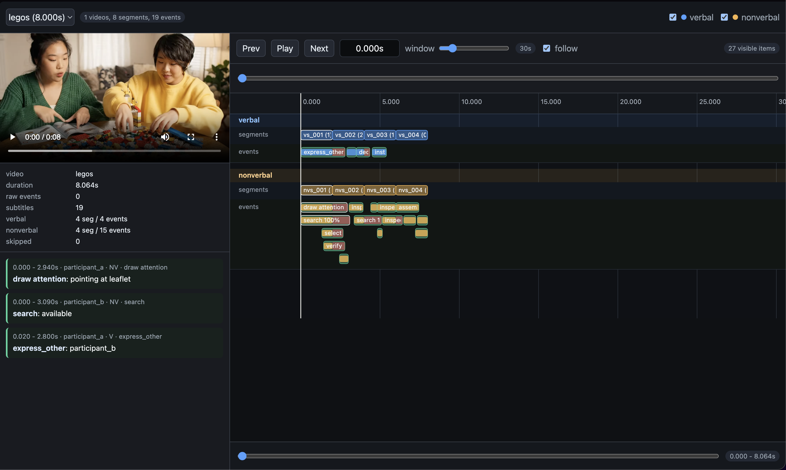

# Timeline Viewer

An interactive web-based timeline viewer for video with synchronized annotations and subtitles. Built with Python and a modern dark-themed web interface.

## 🎯 Purpose

The Audit Timeline Viewer helps you:
- **Visualize video events** in an interactive timeline with pixel-perfect playback control
- **Review annotations** across multiple event channels (verbal & nonverbal labels)
- **View subtitles** synchronized with video playback
- **Audit groundtruth data** with detailed visibility metrics and event tracking
- **Analyze segment-level events** in t-second evaluation windows

Perfect for computer vision researchers, video annotation teams, and quality assurance workflows.

## ✨ Features

- **Interactive Timeline** – Drag, zoom, and scrub through video events
- **Multi-channel Support** – Display verbal and nonverbal labels side-by-side
- **Synchronized Playback** – Video plays in sync with timeline position
- **Subtitle Display** – SRT subtitle integration for audio/speech context
- **Video Streaming** – Byte-range streaming for efficient video delivery
- **Dark Theme UI** – Optimized for extended viewing sessions
- **Event Visibility Metrics** – Track overlap ratios and segment assignments
- **Flexible Discovery** – Auto-detect videos, annotations, and subtitles

## 🚀 Quick Start

### Installation

1. Clone the repository:
```bash
git clone <your-repo-url>
cd video-parser
```

2. (Optional) Create a virtual environment:
```bash
python -m venv venv
source venv/bin/activate  # On Windows: venv\Scripts\activate
```


### Try the Multi-Video Demo

The channel-first label format in `new-version.json` can be paired with video and subtitle folders:

```bash
python -m audit_timeline_viewer \
  --input new-version.json \
  --video-root data/videos \
  --subtitle-root data/subtitles \
  --open
```

### Running with Your Own Data

For your own audit data:

```bash
python -m audit_timeline_viewer --input your_groundtruth.audit.json
```

Add optional files to enrich visualization:

```bash
python -m audit_timeline_viewer \
  --input your_groundtruth.audit.json \
  --video-file your_video.mp4 \
  --subtitle-file your_subtitles.srt \
  --annotation-file your_annotations.json \
  --open
```

## 📋 Command-Line Options

| Option | Type | Default | Description |
|--------|------|---------|-------------|
| `--input` | Path | **required** | Path to `groundtruth.audit.json` file |
| `--host` | str | `127.0.0.1` | Server host address |
| `--port` | int | `8765` | Server port number |
| `--video-file` | Path | optional | Single video file for single-video audits |
| `--video-root` | Path | optional | Directory containing videos (named by `video_id`) |
| `--subtitle-file` | Path | optional | SRT subtitle file for single-video audits |
| `--subtitle-root` | Path | optional | Directory containing SRT subtitles named by `video_id` |
| `--annotation-file` | Path | optional | Source annotation JSON for event labels |
| `--open` | flag | `false` | Auto-open viewer in default browser |

## 📁 Project Structure

```
audit_timeline_viewer/
├── cli.py                 # Command-line interface & app orchestration
├── __main__.py            # Entry point for `python -m audit_timeline_viewer`
├── core/
│   ├── annotations.py     # Annotation metadata loading
│   ├── io.py              # File I/O with encoding fallback
│   ├── labels.py          # Event label utilities
│   ├── normalization.py   # Audit data normalization
│   ├── parsers.py         # Data format parsers
│   └── values.py          # Value conversion helpers
├── discovery/
│   ├── companions.py      # Find annotation & subtitle files
│   └── videos.py          # Video file discovery
├── subtitles/
│   └── srt.py             # SRT subtitle parsing
└── web/
    ├── server.py          # HTTP server & request handler
    ├── assets.py          # Asset loading (HTML, CSS, JS)
    └── static/
        └── index.html     # Web UI
```

## 🌐 Web Interface

The interactive timeline viewer provides:

- **Timeline Track** – Visualizes segments and events with color coding
  - 🔵 **Blue** – Verbal labels
  - 🟠 **Orange** – Nonverbal labels
  - 🟢 **Green** – Events
  - 🔴 **Red** – Visibility loss indicators

- **Video Player** – Integrated playhead synchronized with timeline
- **Event Inspector** – Click events to view detailed metadata
- **Search & Filter** – Navigate events by ID, label, or time range

### UI Preview

Here's the viewer displaying the `legos.mp4` example with interactive timeline and annotations:



**In this example:**
- **Left Panel** – Video player with HHOI interaction data (Legos assembly)
- **Center/Right** – Multi-channel timeline showing:
  - **Verbal segments** (blue) with dialogue/speech labels
  - **Nonverbal segments** (orange) with action labels (draw_attention, grasp, search, etc.)
  - **Time ruler** with precise scrubbing capability
  - **Event boxes** color-coded by type and visibility
- **Metadata sidebar** – Summary stats, event details, and timeline events

## 📖 Audit Segmentation Rules

The viewer implements these segmentation principles:

- **Segment Length**: 2 seconds
- **Event Visibility Threshold**: 70% (events visible in ≥70% of segment show as assigned)
- **Channel Separation**: Verbal and nonverbal labels stay in separate tracks
- **Overlap Rules**: Events grouped when overlapping ≥70% of shorter event duration

See [`GUIDE.MD`](./GUIDE.MD) for complete segmentation algorithm details.

## 🐛 Troubleshooting

### Video not found
- Ensure video file exists at the specified path
- Check `video_id` matches the filename (without extension)
- Use `--video-root` for directory-based discovery

### No events showing
- Verify `groundtruth.audit.json` contains event data
- Check that `segment_len`, `segment_id`, and channel names match expected format

### Port already in use
- Change port: `--port 8766`
- Or kill existing process: `lsof -ti :8765 | xargs kill -9`

## 📝 Example Workflow

```bash
# 1. Start the viewer with sample data
python -m audit_timeline_viewer \
  --input legos.json \
  --video-file legos.mp4 \
  --subtitle-file legos.srt \
  --open

# 2. Open browser at http://127.0.0.1:8765
# 3. Interact with timeline:
#    - Click/drag playhead to seek
#    - Hover events for details
#    - Use zoom controls for precision
#    - Read subtitles below video

# 4. Export findings (via inspector or browser console)
```

## 📄 License

This project is part of the UDIVA research initiative.

## 👥 Contributing

Found a bug? Have a feature request? Please open an issue or submit a pull request.
